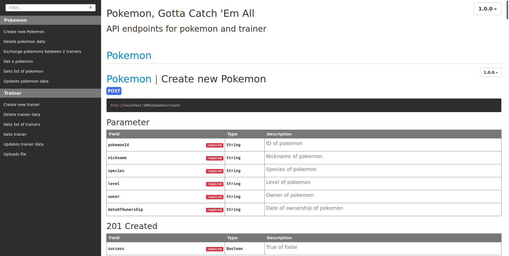
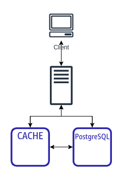
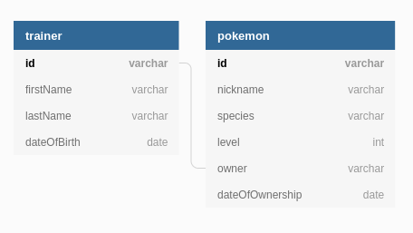
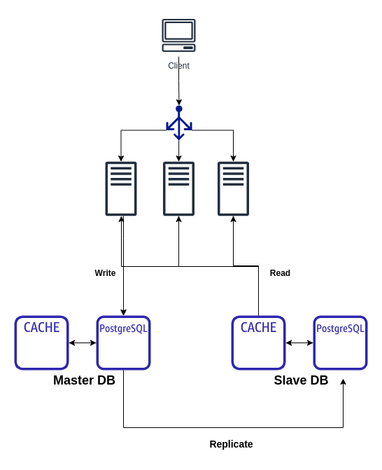

# Pokemon

<!-- ABOUT THE PROJECT -->

## About The Project

API Endpoints for Trainer and Pokemon to perform basic CRUD operations and exchange pokemons

## API Endpoints documentation
```
# open docs/index.html with your favourite browser
$ firefox docs/index.html
```

## Screenshot of documentation



## Development Methodology

Test driven development (TDD) with unittesting. 

Unittests for each routes are created before development and iteratively tested to ensure routes passes each tests. 

## Tech Used

1. FlaskAPI as RESTful API endpoints
2. Postgres as relational database
3. SQLAlchemy as ORM
4. Redis as in-memory cache

- Since trainer and pokemon are related via owner variable, we use a relational database to map this relation. This allows us to use join operations to query from the database as compared to a NoSQL database. 
- Redis caching mechanism is used to cache rows of data that are read from the CSV after validation. This allows us to perform the upload as a transaction after validating all the rows in the CSV. 
- Having an in-memory cache allows for faster read speeds as compared to having data on disk. This allows us to scale the program in the future with more daily active users (DAU) as the queries per second (QPS) will also increase.

NOTE: 
- RDBMS adheres to ACID principles and should be able to provide transaction functionality by default (atomicity). 
- However, we are implementing upload as a transaction using Redis Cache to allow faster queries in the future
- Thus, Redis Cache will be populated with current data during seeding stage

### Architecture

Current architecture with single server and single master db.

NOTE: 
- Cache is only used to implement upload as a transaction
- Future plans to use cache to improve query speed



## DB Schema Design



<!-- GETTING STARTED -->

## Getting Started

1. Clone the repo

```
$ git clone https://github.com/indra4837/pokemon.git

```

2. Create python virtualenv

```
# install virtualenv
$ pip install virtualenv

$ python3 -m venv venv
$ source venv/bin/activate
```

2. Install dependencies for this project

```
# python packages
$ pip install -r requirements.txt

# apidocs for automatic documentation (require npm)
$ npm install apidoc -g
```

3. Place the following variables in `.env` file

```
source venv/bin/activate
export FLASK_APP="run.py"
export SECRET="any-long-string"
export APP_SETTINGS="development"
export DATABASE_URL="postgresql:///poke_db"
```

4. Source environment variable

```
$ source .env
```

5. Create test db and production db

```
# testing
$ createdb test_db

# production
$ createdb poke_db
```

6. Migrate db model schema into database

```
$ flask db init
$ flask db migrate
$ flask db upgrade
```

7. Generate documentations via apidoc
```
# generate apidocs
$ python manage.py apidoc

# generate apidocs static assets
$ apidoc -i app/ -o docs/

# fire up documentation on your favourite browser
$ firefox docs/index.html
```

8. Start redis-server and run flask app

```
# In another terminal
$ redis-server

$ flask run
```

<!-- USAGE EXAMPLES -->

## Usage

After running the API endpoints, you can test them via the browser by visiting the routes or using [Postman](http://postman.com).

<!-- ROADMAP -->

## Roadmap

1. Containerize solution into Docker
2. Refactor codebase into Divisional Structure based on type of program (pokemon,trainer etc.)
3. More unittests to cover edge cases and provide ~100% code coverage (routes code)
4. Implement Caching to improve query speed for scalability
    * Cache results of queries for faster future read speeds
    * For every query: if result in cache then return, else query from database
    * Implement caching expiration/eviction policies to prevent stale/bloated cache
5. Horizontal scaling with more servers, load balancers and master-slave DB

## Future Architecture Revamp

<!-- ### Back of envolope calculation

- Max 1GB file size for each upload transaction
- 1 million DAU with 10 queries / day
- Queries / day: 1x10<sup>7</sup> queries
- Peak / day: 2x10<sup>7</sup> queries -->


- Horizontal scaling of servers with load balancer to redirect traffic
- Master - Slave DB. Write operations only done on master db and read from slave db
- Data replication between master and slave db to ensure consistency



<!-- LICENSE -->

## License

Distributed under the MIT License. See `LICENSE` for more information.
